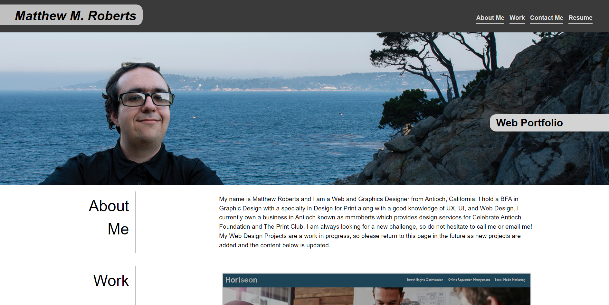
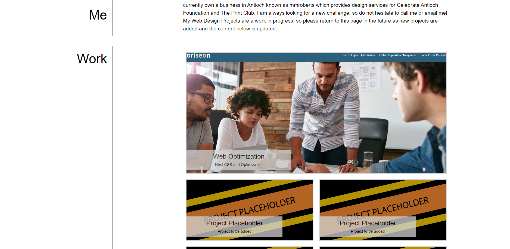

# PORTFOLIO SITE

## Description

The goal of this project is to create a professional portfolio site utilizing HTML, CSS, and flexbox from the ground up. The site should display several projects, include links to jump through the page, scale when minimized or opened on mobile, and be stylized for easy readibility and user experience.

## Installation

N/A

## Usage

The page can be found online through the following github pages link: https://mattmrob.github.io/portfolio/
The viewer can see several projects, read text, interact with links, and resize the page as needed.

## Credits

Andy Bell for their reset.css document found at https://dev.to/hankchizljaw/a-modern-css-reset-6p3
Pointer Events None usage found from Allisone at https://stackoverflow.com/questions/3680429/click-through-div-to-underlying-elements
On hover scale idea from Lucy Wheel at https://codepen.io/lucy_wheel/pen/VxYzKP

## License

MIT License